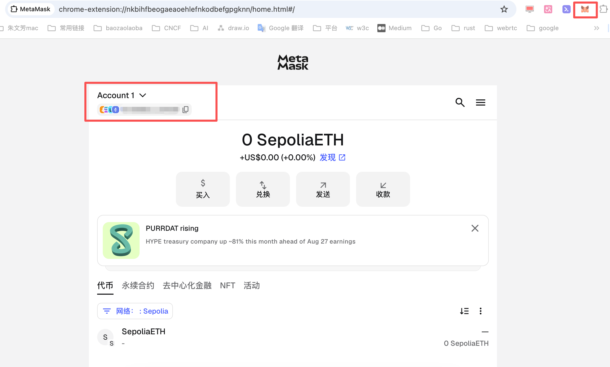
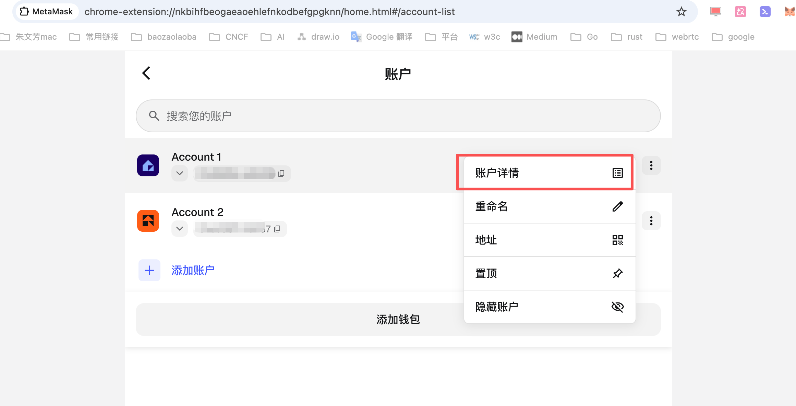
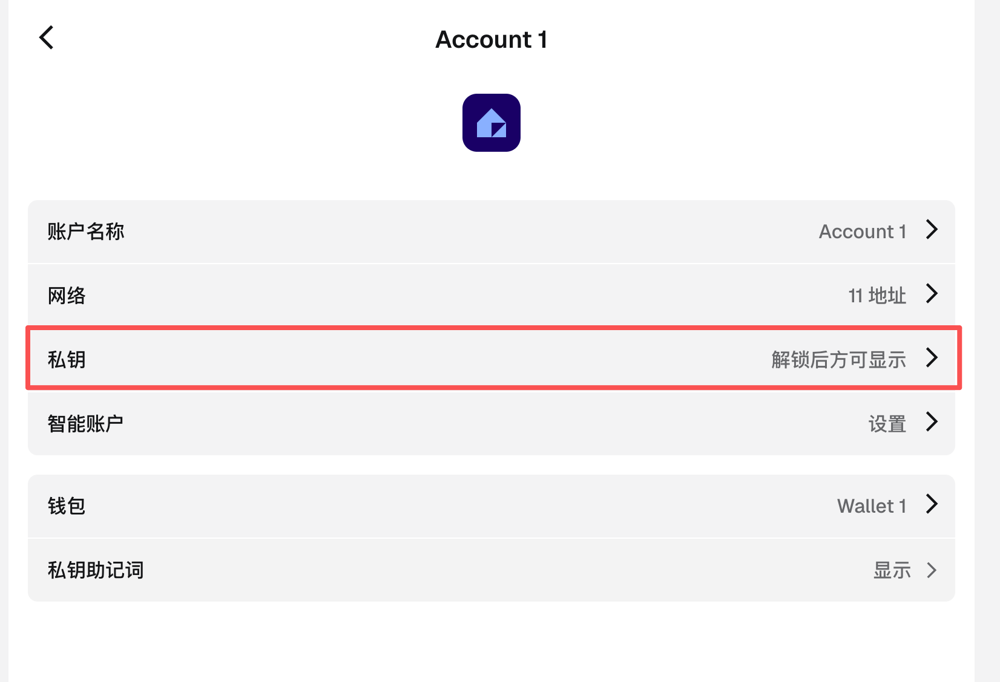
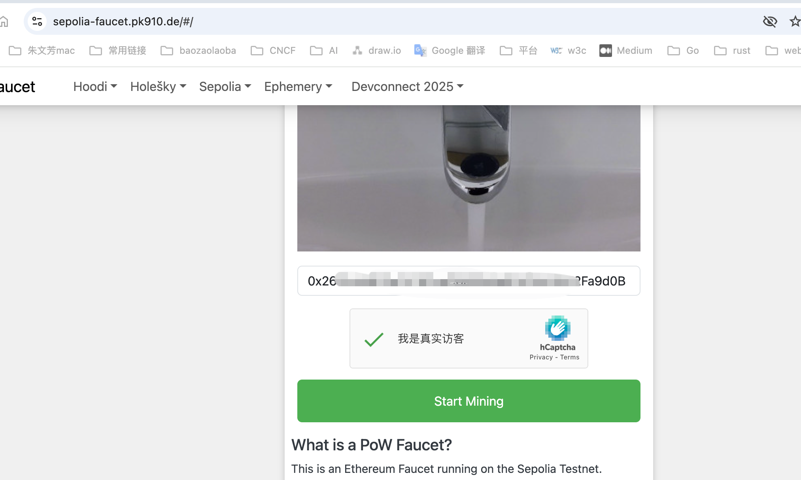
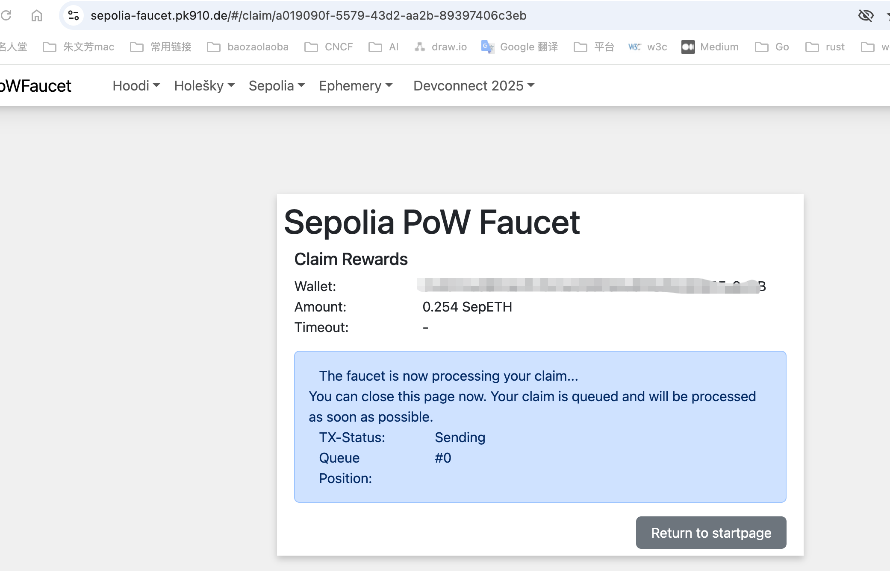
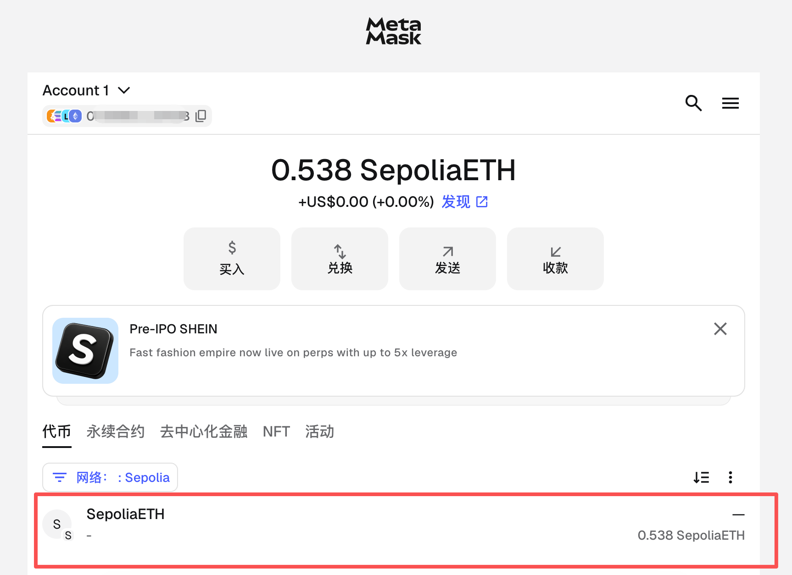
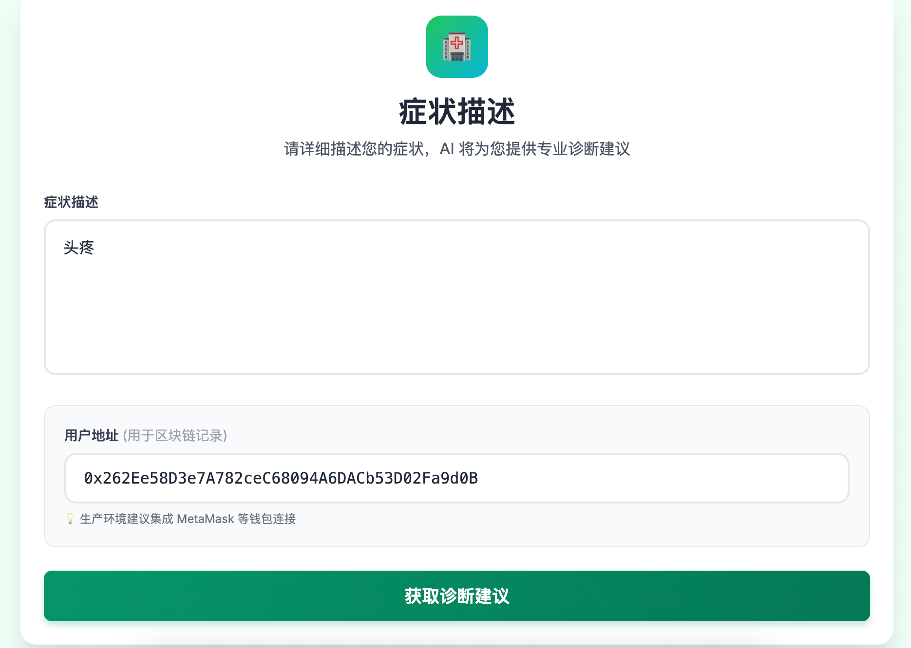
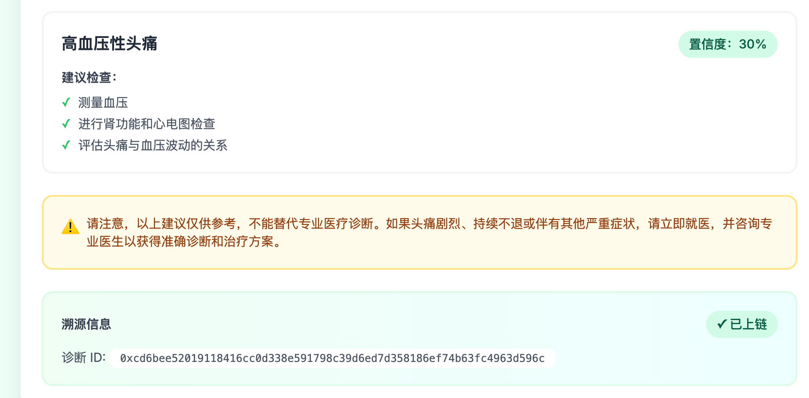
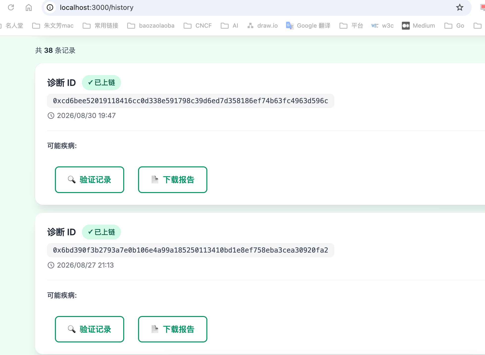
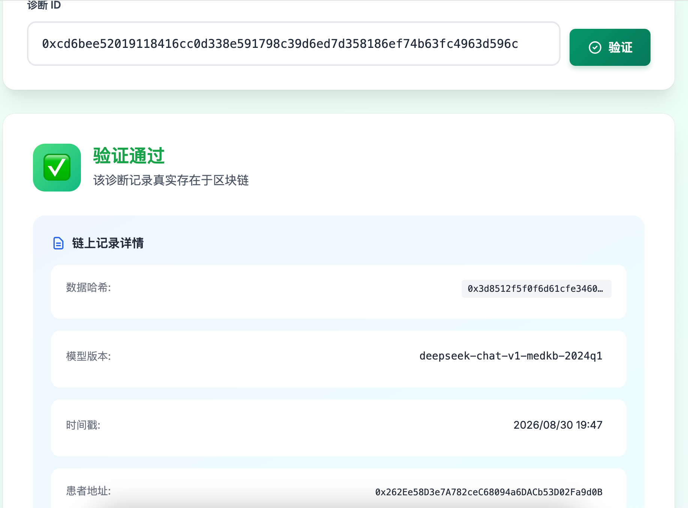

> 很多人觉得区块链"高大上、摸不着"。这篇文档带你**亲手**走一遍开发流程：装插件 → 配置开发环境 → 连接测试链 → 调用智能合约。全程不需要花一分钱，做完你就知道区块链到底是怎么"实战"的。
>
> ⚠️ **说明**: 本文仅用于技术学习和开发实践，不涉及任何真实资产交易或投资建议。

---

## 📦 第一步：安装 MetaMask 插件

1.  打开 Chrome / Edge 浏览器
2.  访问 MetaMask 官网(需科学上网)：`https://metamask.io/`
3.  点 **Download** → 按浏览器提示安装扩展
4.  安装后右上角出现 🦊 狐狸图标
5.  点击狐狸图标，按提示**创建钱包**（Create a Wallet）
    - 设置解锁密码
    - **务必抄下 12 个助记词并离线保存**（这是找回钱包的唯一凭证）

---

## 🔑 第二步：获取私钥

私钥 = 你账户的"签名钥匙"，写代码、调接口、发交易都要用到它, 下面是详细步骤

点击下图中的账户



点击钱包里账户名旁边的 **圆点图标**（账户菜单）→ 选择 **Account details**（账户详情）。



在账户详情页点 **Show private key**（显示私钥）→ 输入你的 MetaMask 密码 → 确认。
屏幕上会出现一串以 `0x` 开头的 64 位字符，这就是**私钥**，点复制按钮保存到本地文件：



> 🔒 **铁律：私钥 = 你的全部资产，谁拿到谁拥有。绝不发给任何人、绝不上传云端、绝不截图发群。**

---

## ⛓️ 第三步：认识 Sepolia —— 区块链的"练习场"

Sepolia 是以太坊的**公开测试网**，和主网机制几乎一样，但：

| 对比         | 主网（Ethereum Mainnet） | 测试网（Sepolia）      |
| ------------ | ------------------------ | ---------------------- |
| 花的钱       | 真实 ETH，很贵           | **测试币，免费**       |
| 用途         | 真实资产交易             | 练手、开发、试错       |
| 能不能随便玩 | 不行，错了就亏钱         | **随便玩，错了无所谓** |

一句话：**主网是"真金白银"，Sepolia 是"模拟练习"。** 开发者的代码都先在测试网验证，没问题才上主网。

### 挖矿：测试币从哪来？

- Sepolia 的测试币可以**自己挖**（运行节点挖矿，进阶玩法），也可以去**水龙头网站免费领**，比如 `https://sepoliafaucet.com/`（用 GitHub 登录，填钱包地址，几分钟到账）
- 领到的测试币专门用来付 **Gas 费**（上链手续费）

登录水龙头网站 → 输入 MetaMask 的 Account 中的公钥 (即钱包地址) → 点击开始挖矿 → 等待 5 分钟左右，结束挖矿, 测试币就到账了。





### 切换到 Sepolia

MetaMask 顶部网络下拉菜单 → 选 **Sepolia**；如果没有，就 Add network 手动添加：

    Network Name: Sepolia
    RPC URL:      https://rpc.sepolia.org
    Chain ID:     11155111
    Currency:     SepoliaETH



一切准备就绪后, 便能开发项目了

# MediTrace 项目

> 医疗 AI 诊断溯源系统 - 从诊断到上链认证的完整流程

## 🏥 项目简介

**MediTrace** 是一个结合大模型与 Web3 技术的医疗诊断辅助系统。通过区块链记录每次 AI 诊断的数据来源和模型版本，满足医疗合规审计需求。

**技术栈**: Next.js | FastAPI | Solidity | DeepSeek API | IPFS

---

## 📸 核心功能流程

### 1️⃣ AI 智能诊断



**功能说明**:

- 用户输入症状描述
- AI 基于 DeepSeek 大模型 + 医学知识库 RAG 提供专业诊断建议
- 流式响应，实时显示诊断过程
- 诊断结果包含：可能疾病、建议检查、用药参考

**技术亮点**:

- 流式响应显示，用户体验流畅
- 医学专业知识库增强
- 支持多轮对话追问

---

### 2️⃣ 历史记录查询



**功能说明**:

- 查看所有历史诊断记录
- 按时间倒序排列，最近诊断优先
- 每条记录显示：诊断时间、主要症状、AI 诊断结果
- 支持点击查看完整诊断报告

**技术亮点**:

- 本地 SQLite 数据库存储
- 完整的诊断上下文保存
- 快速检索和分页展示

---

### 3️⃣ 区块链上链认证



**功能说明**:

- 每次诊断自动记录到区块链
- 记录内容包括：数据哈希、模型版本、时间戳
- 智能合约确保数据不可篡改
- 提供链上交易哈希供验证

**技术亮点**:

- Solidity 智能合约
- 自动上链，无需用户操作
- 支持本地 Hardhat 网络和 Sepolia 测试网部署

---

### 4️⃣ 链上记录验证



**功能说明**:

- 输入交易哈希或诊断 ID
- 验证记录的真实性和完整性
- 显示链上原始数据
- 确认数据未被篡改

**技术亮点**:

- 直接读取区块链数据
- 哈希比对验证机制
- 透明可审计的设计

---

## 🎯 核心价值

### 对患者的价值

- ✅ **透明度**: 清楚了解 AI 诊断的依据
- ✅ **可追溯**: 每次诊断都有永久记录
- ✅ **可验证**: 任何人都能验证诊断记录真实性

### 对医疗机构的价值

- ✅ **合规审计**: 满足医疗监管要求
- ✅ **责任界定**: 明确诊断数据来源和模型版本
- ✅ **数据保护**: 区块链 + IPFS 确保数据安全

### 对开发者的价值

- ✅ **全栈展示**: AI + Web3 + 传统 Web 开发
- ✅ **工程规范**: 完整的文档和测试
- ✅ **创新场景**: 医疗 + 区块链的落地实践

---

## 🚀 快速开始

### 环境要求

| 工具         | 版本     | 说明           |
| ------------ | -------- | -------------- |
| Node.js      | \>= 18   | 前端和合约开发 |
| Python       | \>= 3.10 | 后端开发       |
| Hardhat      | 2.x      | 区块链开发     |
| DeepSeek API | -        | 大模型调用     |

### 启动服务

```bash
# 1. 克隆项目
git clone https://github.com/zfz193071/meditrace.git
cd meditrace

# 2. 部署智能合约
cd src/contracts
npm install
npx hardhat node                    # 终端 1: 启动本地节点
# 新终端
npx hardhat run scripts/deploy.ts --network localhost

# 3. 启动后端（必须使用虚拟环境）
cd src/backend
python3 -m venv venv
source venv/bin/activate
pip install -r requirements.txt
cp .env.example .env
# 编辑 .env 填入 DeepSeek或其他大模型 API Key
./venv/bin/python main.py

# 4. 启动前端
cd src/frontend
npm install
cp .env.example .env.local
npm run dev
```

访问 <http://localhost:3000> 开始体验。

---

## 🌟 开源仓库

**GitHub**: <https://github.com/zfz193071/meditrace>
